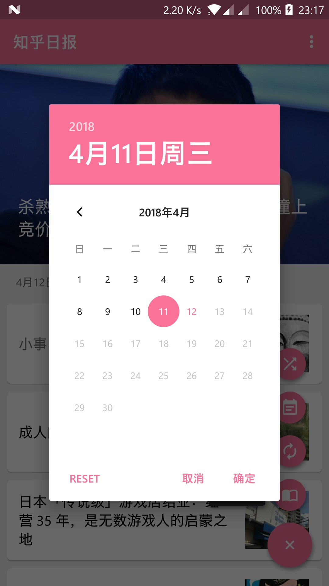
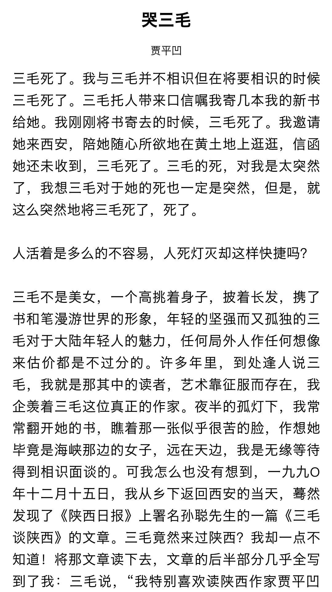
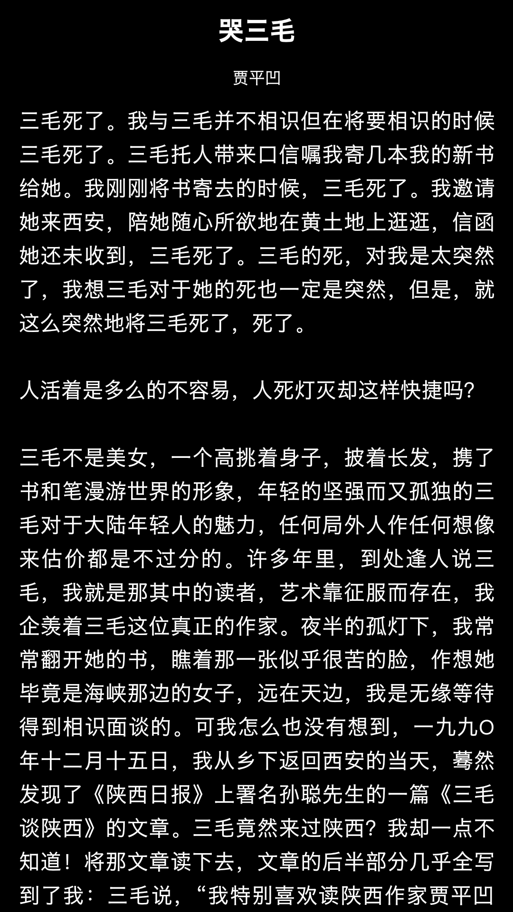
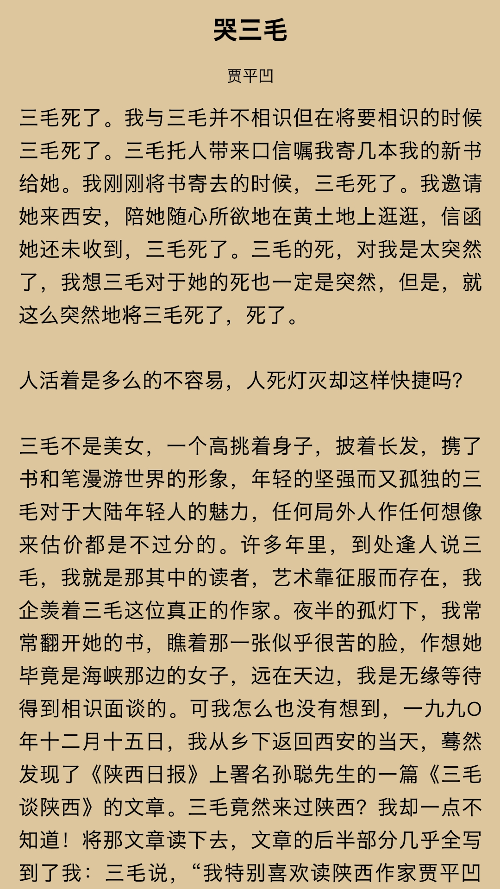

# 简阅(SimpleRead)
以Kotlin实现的简单纯净的阅读软件,主要使用到MVP+RxJava+Retrofit+RxLifecycle+Glide+GreenDao等技术
### 软件开发背景
简阅是我学习安卓开发的第一个项目,最初是使用传统的MVC模式,然后一步步迭代,由MVP再到Kotlin.如今项目功能已经基本稳定,我将项目规范了下,
然后开源供大家交流学习,毕竟当时学习也看了很多前辈的项目,学到了很多,所以现在是时候回报开源社区啦。
### 软件地址
[酷安下载地址](https://www.coolapk.com/apk/com.lesincs.simpleread)
### 软件截图

### 实现的功能
##### 知乎日报
* 获取知乎日报最新新闻
* 上拉加载前一天知乎新闻
* 可选择阅读具体某天的知乎新闻
* 可随机阅读一篇知乎新闻
* 已读新闻灰显
* 收藏/取消收藏某一篇新闻
* 分享新闻
##### 煎蛋新鲜事
* 获取最新煎蛋新鲜事
* 上拉加载前一天新鲜事
* 已读新闻灰显
* 收藏/取消收藏某一篇新闻
* 分享新闻
##### 每日一文
* 查看当天的文章
* 随机一篇文章
* 三种阅读风格切换
#### 其余
* 遵循Material Design设计
* 多种主题选择
* Frament懒加载
* 网络缓存
* 离线缓存
### 技术慨要
* MVP
  >MVP是目前安卓开发中最流行的架构之一,Model负责数据和业务逻辑,View层负责view相关的展示以及context层的调用,Presenter层负责使M层和V层交互
* [RxJava](https://github.com/ReactiveX/RxJava)
  >RxJava是一个基于事件流的异步响应框架

  [给 Android 开发者的 RxJava 详解 -- 扔物线](http://gank.io/post/560e15be2dca930e00da1083)
* [Retrofit](https://github.com/square/retrofit)
  >RESTful的HTTP网络请求框架,优势在于可以结合RxJava实现链式网络请求以及轻松实现线程调度,同时它是以注解的方式标注请求,优雅简洁
* [RxLifecycle](https://github.com/zhihu/RxLifecycle)
  >RxLifecycle是知乎团队出的一个方便取消RxJava订阅的库,使用它结合RxJava无需再到onDestory()中取消订阅
* [GreenDao](https://github.com/greenrobot/greenDAO)
  >GreenDao是一个老牌ORM数据库框架,目前3.2.2版本可以说是最值得使用的ORM框架
* [Glide](https://github.com/bumptech/glide)
  >一个API简洁但是功能极为强大的图片加载框架
* [jsoup](https://github.com/jhy/jsoup)
  >jsoup是一个强大的解析html网页源码的库
* [BaseRecyclerViewAdapterHelper](https://github.com/CymChad/BaseRecyclerViewAdapterHelper)
  >一个快速实现RecyclerviewAdapter的库,和普通写法比起来能减少70%代码量
* 其余还有一些相关技术就不一一罗列出来了,大家可以自行查看源码.
